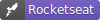
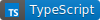

<h2 align="center">
   Ignite Todo List | 
</h2>
<p align="center">




</p>

<p align="center">
  <a href="#-projeto">Project</a>&nbsp;&nbsp;&nbsp;|&nbsp;&nbsp;&nbsp;
  <a href="#-como-rodar-o-projeto">Quick start</a>&nbsp;&nbsp;&nbsp;|&nbsp;&nbsp;&nbsp;
  <a href="#-tecnologias">Technologies</a>&nbsp;&nbsp;&nbsp;|&nbsp;&nbsp;&nbsp;
  <a href="#-Layout">Layout</a>&nbsp;&nbsp;&nbsp;|&nbsp;&nbsp;&nbsp;
  <a href="#-licença">License</a>
</p>

## 💻 Project

This project was created during the challenge on ReactJS path. On this challenge was development an application to control tasks, like a **to-do list**. This app have the following features:

- [x] Add a new task
- [x] Mark and unmark a task as completed
- [x] Remove a task
- [x] Show the progress of task completion

## 🧭 Como rodar o projeto

**Clone this repository**

```bash
git clone
```

**Go to the folder**

```bash
cd 01-ignite-desafio-toDoList
```

**Install dependencies**

```bash
npm install
```

**run application**

```bash
npm run dev
```

## 🚀 Technologies

- [ReactJS](https://pt-br.reactjs.org/)
- [TypeScript](https://www.typescriptlang.org/pt/)
- [Vite](https://vitejs.dev/)

## 🔖 Layout

You can see the layout of this project throught [this link](https://www.figma.com/file/0n0zDN7zbzhRbaEO74Xesx/ToDo-List). It is necessary have a [Figma](https://figma.com) account to access.


## 📝 License

<p>
  
</p>
